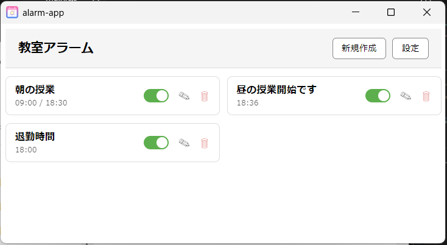

# React.jsでつくったアラームアプリ

## 概要
- JavaScript（React含む）を独学で学んでいる最中で、Copilotを使用して作成したアラームアプリです。
- 「5秒だけ鳴らしたい」「毎時10分に鳴らしたい」というニーズを満たすWindows向けアプリがなかったため作成しました。

# ファイルについて
- packageフォルダは実行可能なポータブル版EXEです。
- それ以外はWEB版のソースコードです。
  WEB版リンク：https://sakamotomelife-maker.github.io/Alarm-App/

# 主な機能
- 曜日指定、日付指定、毎月○○日という繰り返し利用を見越した設計
- 時間内で毎時○○分に作動という処理により作成するアラーム数を削減
- 継続時間の指定を秒数でも可能
- EXE版はアラームのインポート/エクスポート機能あり
- EXE版はタスクトレイに常駐する使用

# 技術ポイント
- Electron + React + Vite + TypeScriptのフルスタック構成アプリ
- ElectronのNotification APIによるOSの通知機能(EXE版)
- UIの細かいこだわり(編集画面Modal化によるシンプル設計 + CSSによるUI調整)
- Copilotフル活用によるIPCを用いたRendere <-> Main の安全設計
  ※全てCopilotに任せました。

# スクリーンショット
- アラームリスト画面
  

- 編集Modal画面
